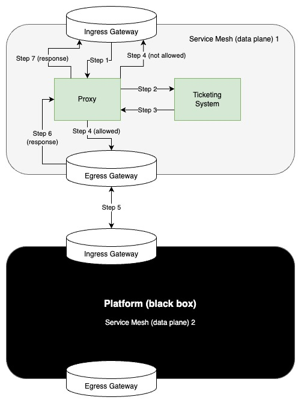

# Camel Proxy Ticketing System

# Application start - testing
* Application startup
  * Application is a Quarkus-Camel application.
  * Start locally:
    ```shell
      ./gradlew quarkusDev
    ```
  * Call application (mock)
    ```shell
      curl --location --request GET 'http://localhost:8080/application'
    ```
    This will return a hard coded value for now.
    ```json
      {
        "data": "request processed ok"
      }
    ```
  * Call ticketing system
    ```shell
      curl --location --request GET 'http://localhost:8080/ticket-system-allowed'
    ```
    This will return that or the ticket is allowed or not allowed (e.g., you are in the waiting queue).
    There is a ranomization in place: by average, one out of three requests should be blocked by 
    the ticketing system.
    ```json
      {
        "status": "allowed"
      }
    ```
    ```json
      {
        "status": "not-allowed"
      }
    ```
  * Call application via proxy
    ```shell
      curl --location --request GET 'http://localhost:8080/proxy/application'
    ```
    This will return or the data (i.e., when you were allowed to enter the platform) or 
    an error when you where not allowed to enter the platform by the ticketing system.
    (Waiting queue functionality is not yet built in).
    ```json
      {
          "error": {
              "ticket-status": "not-allowed"
          },
          "data": null
      }
    ```
    ```json
      {
          "data": "request processed ok"
      }
    ```

## Platform architecture
You can implement this proxy-ticketing functionality with an API Gateway or with a service mesh. 
When implementing it with a service mesh, be aware that it is best to have it as 2 seperated data planes,
 2 separated meshes or even as 2 separated OpenShift clusters (scaling wise).

A possible architecture then looks like this:
